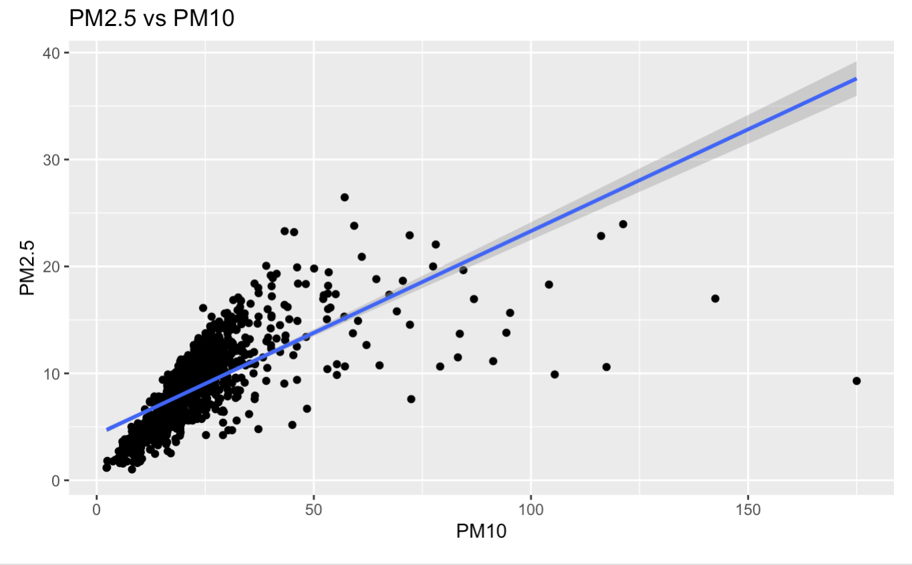
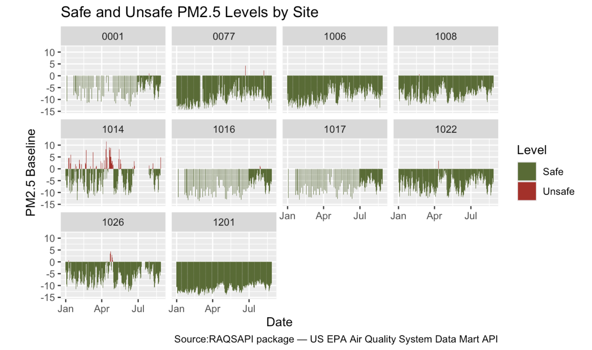
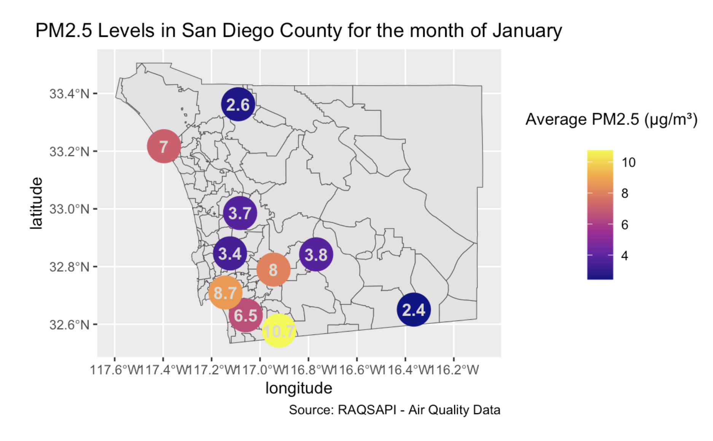
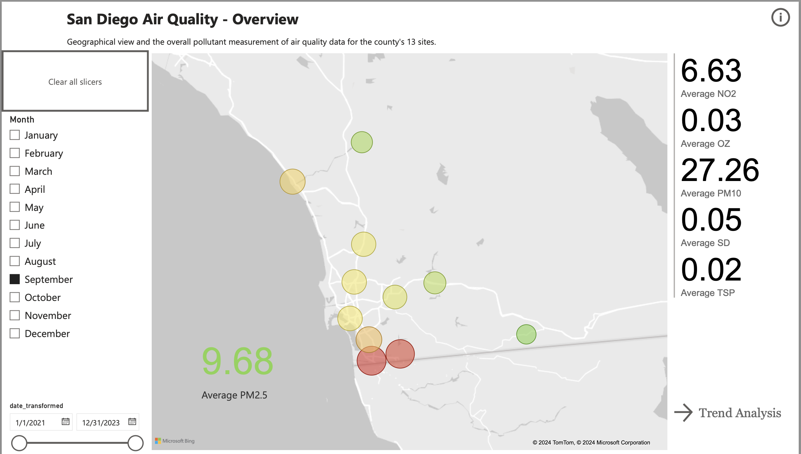
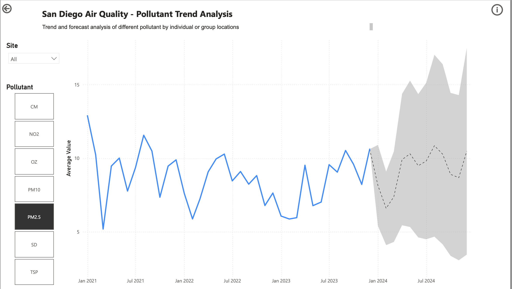
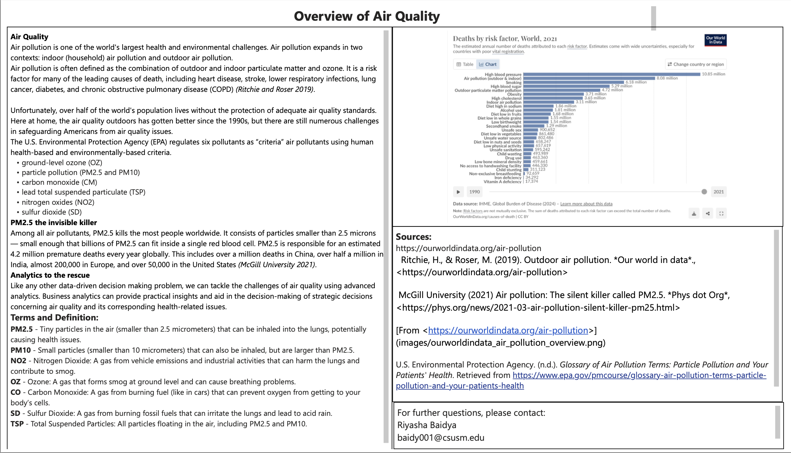

# Air Quality Analysis Project  

## Introduction  
Air pollution is one of the world's largest health and environmental challenges. Air pollution expands in two contexts: indoor (household) air pollution and outdoor air pollution.  

Air pollution is often defined as the combination of outdoor and indoor particulate matter and ozone. It is a risk factor for many of the leading causes of death, including heart disease, stroke, lower respiratory infections, lung cancer, diabetes, and chronic obstructive pulmonary disease (COPD) *(Ritchie and Roser 2019)*.  

Unfortunately, over half of the world's population lives without the protection of adequate air quality standards.  

## Air Quality Data  
The U.S. Environmental Protection Agency (EPA) regulates six pollutants as “criteria” air pollutants using human health-based and environmentally-based criteria:  
- Ground-level ozone (OZ)  
- Particle pollution (PM2.5 and PM10)  
- Carbon monoxide (CM)  
- Lead total suspended particulate (TSP)  
- Nitrogen oxides (NO2)  
- Sulfur dioxide (SD)  

### PM2.5: The Invisible Killer  
Among all air pollutants, PM2.5 kills the most people worldwide. It consists of particles smaller than 2.5 microns — small enough that billions of PM2.5 can fit inside a single red blood cell. PM2.5 is responsible for an estimated 4.2 million premature deaths every year globally *(McGill University 2021)*.  

## Purpose  
This project creates a **visual analytics tool** to analyze, monitor, and forecast air quality for San Diego County. It tackles the challenges of air quality using advanced analytics and R-based tools.  

## Files Included  
- `data/`: Contains air quality datasets.  
- `scripts/`: R scripts and notebooks for analysis.  
- `images/`: Visualizations and images used in documentation.  
- `assignment1_notebook.Rmd`: Main RMarkdown file for Assignment 1.

  ## PM2.5 Visualizations

| PM2.5 vs PM10 | PM2.5 vs CM | PM2.5 vs NO2 |
|---------------|------------|-------------|
 |  |  |

| PM2.5 vs OZ | PM2.5 vs SD | Overall PM2.5 |
|-------------|------------|---------------|
|  |  |  |

## PM2.5 Analysis

  
  

## PM2.5 Analysis Map - January

The map below shows the average PM2.5 levels in San Diego County for the month of January.

## Power BI Analysis

## Power BI Analysis Report

To interact with the full Power BI report, including all visualizations (Overview, Trend Analysis, and Data, Terms, and Definitions), access the link below:

🔗 [View Power BI Report](https://app.powerbi.com/groups/me/reports/8a39a24d-9fc8-439b-aec2-36dec56f8f3f/d4a46f8ecfad3e74caef?experience=power-bi)

---

### Key Pages in the Report:
1. **Overview Page**: Geographical distribution of PM2.5 values.
2. **Trend Analysis Page**: Pollutant trends over time with filtering capabilities.
3. **Data, Terms, and Definitions**: Glossary, data sources, and report notes.

To prepare our Microsoft Power BI report, we engaged in all steps of ETL, data modeling, and data visualization.

### ETL Process
1. **Extract**: Air Quality and Site Data were extracted over three years and saved in stable folders.
2. **Transform**: The datasets were cleaned and transformed to ensure 0% errors, including creating an unpivoted version of the Air Quality data.
3. **Load**: Finalized datasets (`Air Quality`, `Site Data`, `Air Quality Unpivoted`) were loaded for analysis.

### Data Modeling
A relational schema was created connecting the three datasets to analyze and display the results effectively.

---

### Report Structure

### Overview Page
This page shows a geographical view of average PM2.5 values per site.

---

### Trend Analysis Page
This page displays trends of different pollutants over time with slicers for site and pollutant selection.

---

### Data Terms Page
This page provides definitions of key terms, data sources, and additional insights.

### Notes
- All pages include interactivity, slicers, custom tooltips, and navigation buttons.
- Visualizations include geographical maps, line charts with forecasts, and card visuals.
